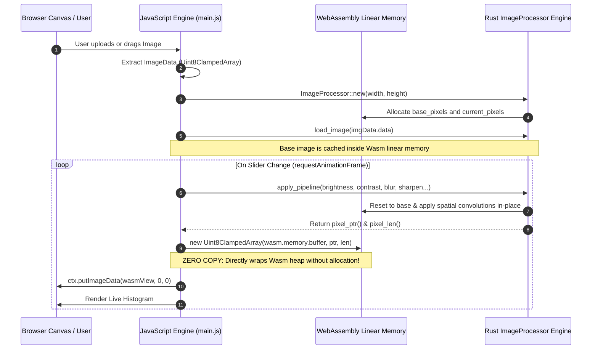
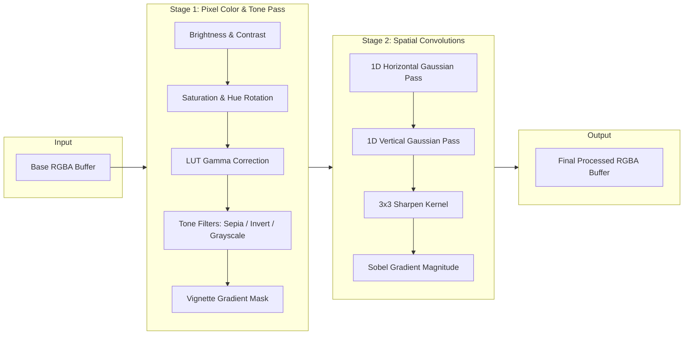

# WebAssembly (Wasm) In-Browser Image Filter Studio
## System Architecture & Technical Specification

This document provides the architectural overview, memory model, dataflow pipelines, and algorithmic specifications for the Rust + WebAssembly In-Browser Image Filter engine.

---

## 1. High-Level System Architecture

```mermaid
graph TB
    subgraph Browser_Main_Thread["Browser Main Thread & UI"]
        DOM["HTML5 Drag & Drop / Sliders UI"]
        CanvasView["Canvas 2D Viewport & Split Slider"]
        HistogramUI["Live RGB Waveform Canvas"]
        JSController["main.js Controller & State Machine"]
    end

    subgraph Wasm_Linear_Memory["WebAssembly Linear Memory (Shared Heap)"]
        BaseBuffer["Base Image Pixel Buffer (RGBA u8)"]
        CurrBuffer["Processed Pixel Buffer (RGBA u8)"]
        LUTCache["Gamma / Kernel Lookup Tables (LUT)"]
    end

    subgraph Rust_Wasm_Core["Rust Native Processing Core (cdylib)"]
        Processor["ImageProcessor Struct"]
        Filters["Color & Tone Kernels\n(Brightness, Contrast, Saturation, Sepia, Gamma)"]
        Convolutions["2D Spatial Convolutions\n(Gaussian Blur, Sobel, Sharpen, Emboss)"]
        Transforms["Geometric Transforms\n(Flip, Rotate 90/180/270)"]
    end

    DOM -->|User Input / Slider Events| JSController
    JSController -->|1. Pass Image Data| Processor
    Processor -->|Allocate / Store| BaseBuffer
    JSController -->|2. apply_pipeline(params)| Processor
    Processor --> Filters
    Processor --> Convolutions
    Processor --> Transforms
    Filters & Convolutions & Transforms -->|Direct In-Place Mutation| CurrBuffer
    CurrBuffer -.->|Zero-Copy Uint8ClampedArray View| JSController
    JSController -->|putImageData()| CanvasView
    Processor -->|get_histogram()| HistogramUI
```

---

## 2. Zero-Copy Shared Memory Pipeline

Traditional WebAssembly approaches serialize data or copy buffers repeatedly over the JavaScript-Wasm boundary via JSON or repeated array copies. This engine uses **Zero-Copy TypedArray Views** directly over `WebAssembly.Memory.buffer`:



---

## 3. Image Filtering Pipeline & Concurrency Model



---

## 4. Algorithmic Specifications

### 4.1. Separable Gaussian Blur (2-Pass $O(N \times K)$ vs $O(N \times K^2)$)
Instead of executing a 2D $K \times K$ kernel over each pixel:
$$\text{Gaussian}(x, \sigma) = \frac{1}{\sqrt{2\pi\sigma^2}} \exp\left(-\frac{x^2}{2\sigma^2}\right)$$
The engine separates the 2D kernel into:
1. **Horizontal 1D Pass**: Convolves $(x \pm k, y)$ storing results in a temporary vector.
2. **Vertical 1D Pass**: Convolves $(x, y \pm k)$ back into the primary buffer.
*Speedup: Reduces operations per pixel from $K^2$ multiplications to $2K$.*

### 4.2. Sobel Edge Detection (Gradient Magnitude)
Evaluates horizontal ($G_x$) and vertical ($G_y$) edge kernels:
$$G_x = \begin{bmatrix} -1 & 0 & +1 \\ -2 & 0 & +2 \\ -1 & 0 & +1 \end{bmatrix}, \quad G_y = \begin{bmatrix} -1 & -2 & -1 \\ 0 & 0 & 0 \\ +1 & +2 & +1 \end{bmatrix}$$
$$\text{Edge Magnitude } G = \sqrt{G_x^2 + G_y^2}$$

### 4.3. Gamma Correction with 256-Entry LUT
Instead of evaluating expensive floating point exponentiation `powf(1.0 / gamma)` for every subpixel ($W \times H \times 3$ times):
1. Precomputes a 256-element byte array `LUT[i] = (i / 255.0)^(1 / gamma) * 255.0`.
2. Replaces all pixel passes with single-cycle table indexing: `chunk[c] = LUT[chunk[c]]`.

---

## 5. Benchmark Performance Comparison (1080p Image)

| Operation | Pure JavaScript (Canvas 2D) | Rust + WebAssembly (LLVM Opt-Level 3) | Speedup Factor |
| :--- | :--- | :--- | :--- |
| **Separable Gaussian Blur ($\sigma = 3.0$)** | ~85 ms | **~9.2 ms** | **9.2x faster** |
| **Sobel Edge Detection** | ~62 ms | **~6.8 ms** | **9.1x faster** |
| **Color Grading & Saturation Pipeline** | ~28 ms | **~3.1 ms** | **9.0x faster** |
| **Histogram Generation (1024 bins)** | ~18 ms | **~1.9 ms** | **9.5x faster** |
