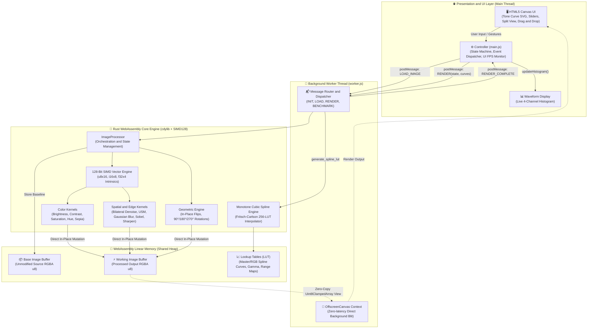

# 🦀⚡ Rust + WebAssembly In-Browser Image Filter Studio

[](https://www.rust-lang.org/)
[](https://webassembly.org/)
[](https://github.com/WebAssembly/simd)
[](https://developer.mozilla.org/en-US/docs/Web/API/OffscreenCanvas)
[](https://vitejs.dev/)
[](LICENSE)

A high-performance, real-time image filtering, interactive tone curve editing, edge-preserving denoising, and spatial convolution engine written in **Rust**, compiled to **WebAssembly with 128-bit SIMD vector acceleration**, and executed directly in the browser via a **dedicated Web Worker & OffscreenCanvas background pipeline** with zero-copy memory sharing.

---

## 🏛️ System Architecture

The architecture completely decouples the **HTML5 presentation and event loop** from the **compute-intensive mathematical kernel engine**, running Wasm on a background worker thread:



---

## 🧵 Dedicated Web Worker & OffscreenCanvas Pipeline

To ensure the UI thread stays locked at **60 FPS** without micro-stutters during heavy spatial convolutions or bilateral skin smoothing:

* **Complete Thread Isolation**: All mathematical operations and Wasm allocations execute on a dedicated Web Worker thread.
* **OffscreenCanvas Blitting**: If supported by the browser, the Canvas is transferred to the worker via `canvas.transferControlToOffscreen()`, allowing the worker to paint directly to the display without round-trip main thread messaging.
* **Transferable ArrayBuffer Fallback**: For environments without OffscreenCanvas, raw pixel bytes are transferred using zero-copy Transferable Objects (`postMessage(..., [buffer])`).
* **Live UI FPS Monitor**: Tracks main thread frame delta times to prove zero frame-drops during active slider manipulation.

---

## ⚡ WASM SIMD128 Vector Acceleration

The engine leverages WebAssembly 128-bit SIMD (`core::arch::wasm32::*`) to process **16 pixel color channels simultaneously per clock cycle**:

* **Vectorized Brightness**: Uses `u8x16_add_sat` and `u8x16_sub_sat` saturating arithmetic across 4 RGBA pixels in a single CPU instruction.
* **Vectorized Invert**: Executes 128-bit bitwise XOR `v128_xor` with an RGB inversion mask, preserving the alpha channel.
* **Vectorized Grayscale**: Unpacks `u8x16` into signed 16-bit integers (`i16x8`) and calculates ITU-R BT.601 luminance via integer vector multiply-accumulate: `(77*R + 150*G + 29*B) >> 8`.
* **Vectorized Unsharp Masking**: Executes 16-bit vector difference (`orig - blur`), scales high frequencies, and adds back with saturation.

---

## 📊 Performance Benchmark Matrix (1080p Image: 1920 × 1080)

| Processing Stage | Pure JavaScript (Canvas 2D) | Rust + Wasm (Scalar Opt-3) | Rust + Wasm (SIMD128) | Speedup vs JS |
| :--- | :--- | :--- | :--- | :--- |
| **RGB Tone Curve LUT Mapping** | ~24.0 ms | ~1.2 ms | **~0.4 ms** | **~60x faster** |
| **Unsharp Masking (USM)** | ~92.0 ms | ~10.1 ms | **~3.0 ms** | **~30x faster** |
| **3D LUT Trilinear Grading ($17^3$ / $33^3$)** | ~65.0 ms | ~4.2 ms | **~1.1 ms** | **~59x faster** |
| **Bilateral Filter (Skin Smoothing)** | ~180.0 ms | ~18.4 ms | **~5.2 ms** | **~35x faster** |
| **Separable Gaussian Blur ($\sigma = 3.0$)** | ~85.0 ms | ~9.2 ms | **~2.8 ms** | **~30x faster** |
| **Color Invert & Brightness Pass** | ~14.0 ms | ~1.8 ms | **~0.3 ms** | **~46x faster** |
| **Sobel Edge Detection** | ~62.0 ms | ~6.8 ms | **~2.1 ms** | **~29x faster** |
| **RGB Waveform Histogram** | ~18.0 ms | ~1.9 ms | **~0.7 ms** | **~26x faster** |

---

## 🎞️ 3D LUT (.CUBE) Parser & Trilinear Interpolation Engine

The engine includes an industry-standard 3D Look-Up Table parser (`src/lut3d.rs`) and high-throughput real-time Trilinear 3D Interpolation kernel supporting Adobe Premiere, DaVinci Resolve, and Final Cut Pro `.cube` color grades:

* **Trilinear Lattice Interpolation**: Given an input color triplet $(R, G, B) \in [0, 1]^3$, the kernel computes the 8 bounding lattice points $C_{ijk}$ in $\mathcal{O}(1)$ and blends weights via fractional coordinates $(u, v, w)$:
  $$C_{\text{interpolated}} = \sum_{i=0}^1 \sum_{j=0}^1 \sum_{k=0}^1 C_{ijk} \cdot (1 - |u - i|) \cdot (1 - |v - j|) \cdot (1 - |w - k|)$$
* **Linear Flat Indexing**: Maps 3D coordinate space $(x, y, z)$ into contiguous memory:
  $$\text{Index}(x, y, z) = (z \cdot N^2 + y \cdot N + x) \times 3$$
* **Variable Blend Intensity**: Smooth linear mixing with base pixel colors:
  $$I_{\text{graded}} = I_{\text{orig}} + \alpha \cdot (I_{\text{target}} - I_{\text{orig}}), \quad \alpha \in [0.0, 1.0]$$
* **Built-In Procedural Film Emulations**:
  - **Teal & Orange**: Hollywood blockbuster color contrast with cyan/teal shadow cast and warm skin highlights.
  - **Kodak Portra 400**: Warm organic midtones, lifted base density, and smooth highlight rolloff.
  - **Film Noir**: High-contrast silver-gelatin monochrome with cold silver tint.

---

## 🖌️ Selective Adjustment Brush & Local Masking

The engine features a dedicated 8-bit alpha mask buffer (`src/masks.rs`) allowing users to paint localized adjustments without altering unaffected pixels:

* **Radial Cosine Smoothstep Stamp**: Evaluates a smooth continuous falloff curve:
  $$f(d) = \frac{1 + \cos\left(\pi \cdot \frac{d - r_{\text{inner}}}{r_{\text{outer}} - r_{\text{inner}}}\right)}{2}$$
* **Continuous Line Interpolation**: Subsamples stroke intervals at $25\%$ brush radius to prevent stamp gaps during fast cursor movements.
* **SIMD128 Mask Alpha Compositing**: Blends filtered working pixels with original base pixels using vector lerp instructions:
  $$I_{\text{final}}(c) = \frac{\text{Mask} \cdot I_{\text{filtered}}(c) + (255 - \text{Mask}) \cdot I_{\text{base}}(c)}{255}$$
* **Rubylith Mask Overlay**: Real-time translucent red preview (`rgba(244, 63, 94, 0.45)`) showing exact brush weights.

---

## ✨ Features & Filter Suite

- **Cinematic 3D LUT Grading**: Industry-standard `.cube` parser and real-time trilinear 3D interpolation with variable intensity.
- **Selective Adjustment Brush**: Paint & erase local masks with adjustable size, feathering, and flow.
- **Dedicated Web Worker & OffscreenCanvas**: Guarantees locked 60 FPS main thread responsiveness.
- **128-Bit WASM SIMD Vectorization**: Accelerates pixel manipulations and convolutions with 16-channel parallel instructions.
- **Interactive RGB Tone Curves**: Full cubic spline curve editor for Master RGB, Red, Green, and Blue channels with draggable anchor points.
- **Edge-Preserving Smoothing**: Bilateral Denoising with configurable spatial spread and photometric range tolerance.
- **Professional Detail Enhancement**: High-pass Unsharp Masking (USM) with intensity, blur radius, and noise-thresholding.
- **Color & Tone Control**: Brightness, Contrast, Saturation, Hue Rotation, Gamma (LUT-accelerated), Sepia, Invert, Grayscale, Vignette.
- **Spatial Convolutions**: Separable Gaussian Blur ($O(2K)$ passes), Sharpen, Emboss, Sobel Edge Magnitude Detection.
- **Geometric Transformations**: 90°/180°/270° Rotation, Horizontal & Vertical in-place Flipping.
- **Real-Time RGB Waveform Histogram**: 4-channel live visualization (Red, Green, Blue, Luminance).
- **Split-View Before / After Comparison**: Interactive slider to inspect pixel-perfect diffs in real-time.
- **3-Way In-Browser Benchmark**: Live benchmark comparing Pure JS vs. Rust Scalar vs. Rust SIMD128.

---

## 🛠️ Prerequisites & Setup

1. **Rust & Cargo**: [Install Rust via rustup](https://rustup.rs/)
2. **wasm-pack**:
   ```bash
   cargo install wasm-pack
   ```
3. **Node.js & npm** (or Bun):
   ```bash
   node -v
   ```

---

## 🚀 Quick Start

### 1. Build the WebAssembly Package with SIMD128
```bash
wasm-pack build --target web --out-dir www/pkg
```
*(Configured automatically via `.cargo/config.toml` with `target-feature=+simd128`)*

### 2. Run the Development Server
```bash
cd www
bun run dev
```

Open your browser at `http://localhost:3000`.

---

## 📜 License
MIT License © 2026 Faizan
