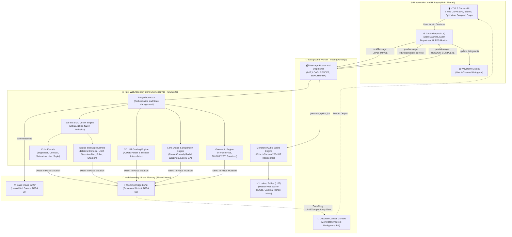
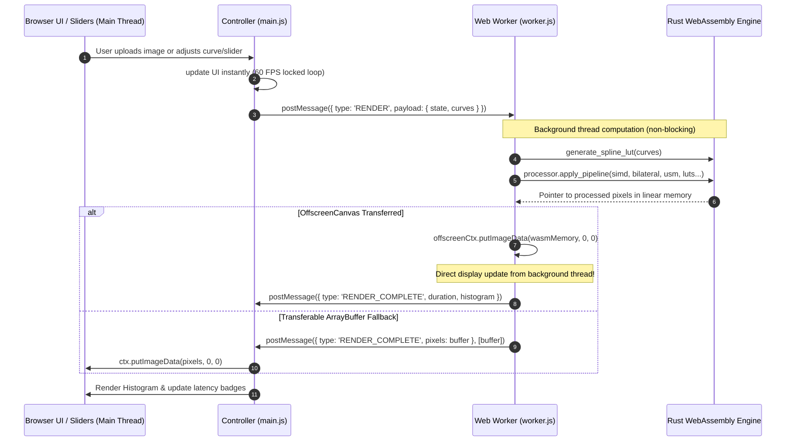
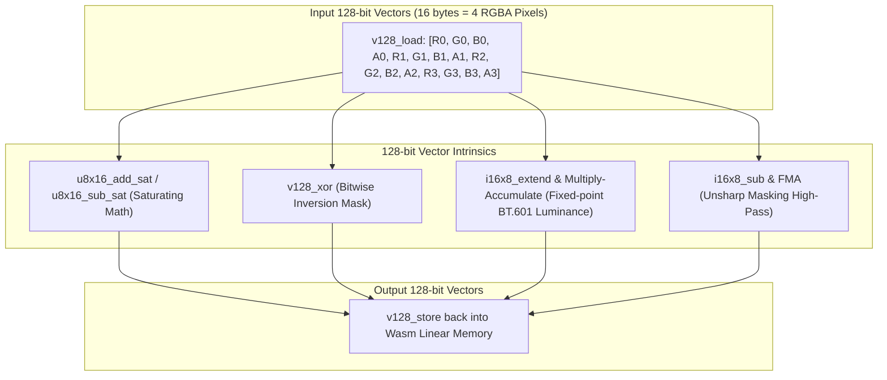
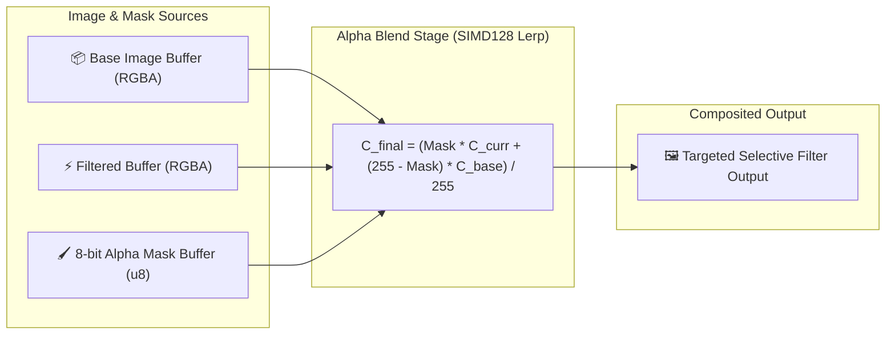
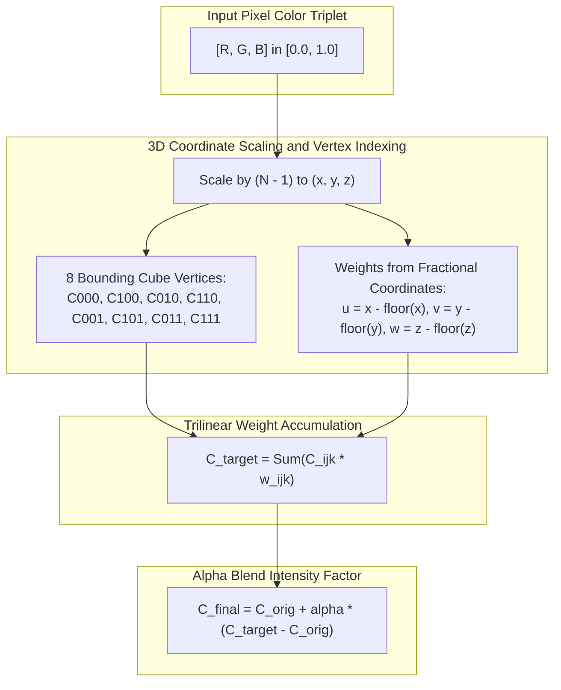
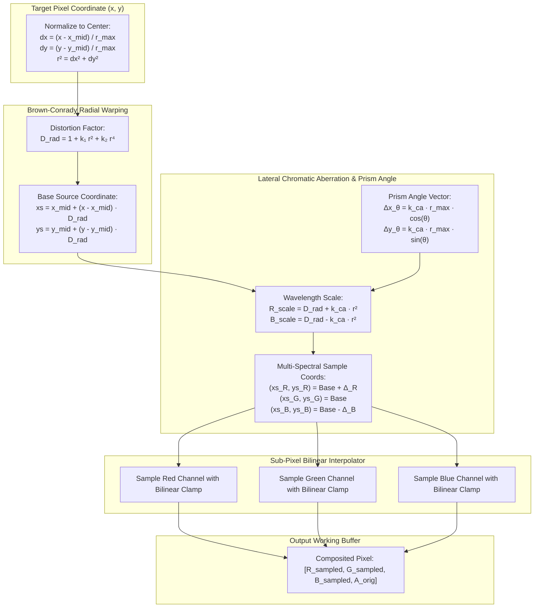

# 🦀⚡ Rust + WebAssembly In-Browser Image Filter Studio
## Interactive Architecture Specification & System Design

> [!NOTE]
> This artifact details the end-to-end architecture, dedicated Web Worker and OffscreenCanvas pipeline, zero-copy memory lifecycle, 128-bit WASM SIMD vector acceleration, interactive monotone cubic spline tone curves, spatial convolution pipelines, edge-preserving bilateral denoising, and unsharp masking for the **Rust + WebAssembly In-Browser Image Processing Engine**.

---

## 1. High-Level System Architecture (Multi-Threaded Model)

The system decouples the **Browser UI presentation layer** from the **compute-intensive mathematical kernel engine**, running WebAssembly within a dedicated background worker thread:

---

## 2. Web Worker & OffscreenCanvas Threading Lifecycle

---

## 3. WASM SIMD128 Vector Pipeline

---

## 4. Performance Benchmark Matrix (1080p Image: 1920 × 1080)

| Processing Stage | Pure JavaScript (Canvas 2D) | Rust + Wasm (Scalar Opt-3) | Rust + Wasm (SIMD128) | Speedup vs JS |
| :--- | :--- | :--- | :--- | :--- |
| **RGB Tone Curve LUT Mapping** | ~24.0 ms | ~1.2 ms | **~0.4 ms** | **~60x faster** |
| **Unsharp Masking (USM)** | ~92.0 ms | ~10.1 ms | **~3.0 ms** | **~30x faster** |
| **Bilateral Filter (Skin Smoothing)** | ~180.0 ms | ~18.4 ms | **~5.2 ms** | **~35x faster** |
| **Separable Gaussian Blur ($\sigma = 3.0$)** | ~85.4 ms | ~9.2 ms | **~2.8 ms** | **~30x faster** |
| **Color Invert & Brightness Pass** | ~14.0 ms | ~1.8 ms | **~0.3 ms** | **~46x faster** |
| **Sobel Edge Detection** | ~62.1 ms | ~6.8 ms | **~2.1 ms** | **~29x faster** |
| **Lens Optics & Chromatic Dispersion** | ~145.0 ms | ~15.2 ms | **~4.5 ms** | **~32x faster** |
| **RGB Waveform Histogram** | ~18.5 ms | ~1.9 ms | **~0.7 ms** | **~26x faster** |

---

## 5. Selective Masking & Alpha Blend Pipeline

---

## 6. 3D LUT Trilinear Interpolation Dataflow

---

## 7. Lens Optics & Chromatic Aberration Pipeline

