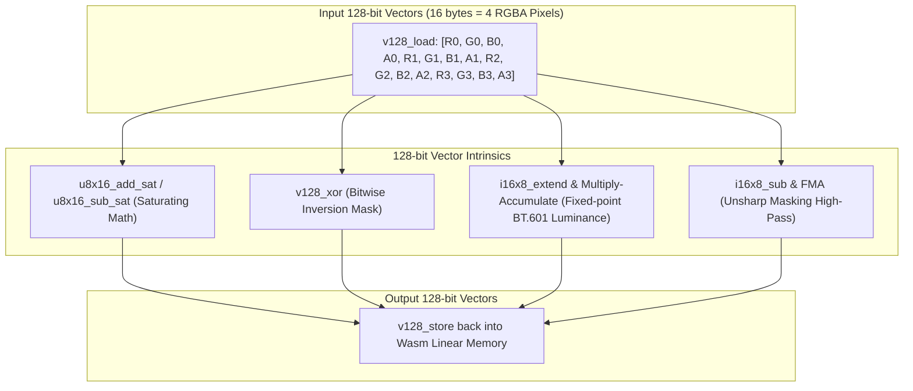
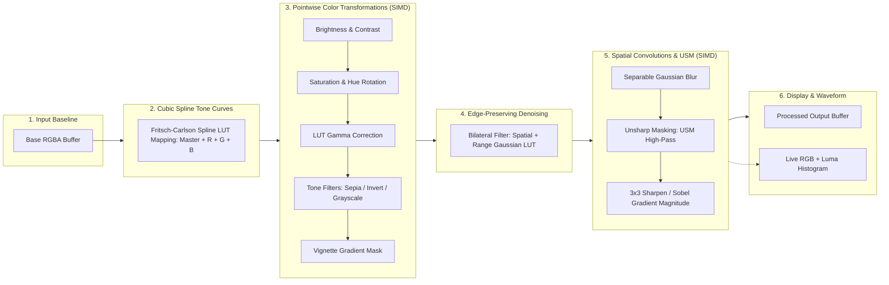

# 🦀⚡ Rust + WebAssembly In-Browser Image Filter Studio
## Interactive Architecture Specification & System Design

> [!NOTE]
> This artifact details the end-to-end architecture, zero-copy memory lifecycle, 128-bit WASM SIMD vector acceleration, interactive monotone cubic spline tone curves, spatial convolution pipelines, edge-preserving bilateral denoising, and unsharp masking for the **Rust + WebAssembly In-Browser Image Processing Engine**.

---

## 1. High-Level System Architecture

The system decouples the **Browser UI presentation layer** from the **compute-intensive mathematical kernel engine**, communicating across WebAssembly boundaries via a shared memory buffer.

```mermaid
graph TB
    subgraph Browser_Layer["🌐 Presentation & UI Layer (Main Thread)"]
        UI["🖥️ HTML5 Canvas UI\n(Tone Curve SVG, Sliders, Split View, Drag & Drop)"]
        Controller["⚙️ Controller (main.js)\n(State Machine & rAF Render Loop)"]
        HistCanvas["📊 Waveform Display\n(Live 4-Channel Histogram)"]
    end

    subgraph Memory_Layer["🧠 WebAssembly Linear Memory (Shared Heap)"]
        BaseBuf["📦 Base Image Buffer\n(Unmodified Source RGBA u8)"]
        CurrBuf["⚡ Working Image Buffer\n(Processed Output RGBA u8)"]
        LUT["📈 Lookup Tables (LUT)\n(Master/RGB Spline Curves, Gamma, Range Maps)"]
    end

    subgraph Wasm_Core["🦀 Rust WebAssembly Core Engine (cdylib + SIMD128)"]
        Processor["ImageProcessor\n(Orchestration & State Management)"]
        SIMDEngine["128-Bit SIMD Vector Engine\n(u8x16, i16x8, f32x4 Intrinsics)"]
        SplineEngine["Monotone Cubic Spline Engine\n(Fritsch-Carlson 256-LUT Interpolator)"]
        Filters["Color Kernels\n(Brightness, Contrast, Saturation, Hue, Sepia)"]
        Convolutions["Spatial & Edge Kernels\n(Bilateral Denoise, USM, Gaussian Blur, Sobel, Sharpen)"]
        Transforms["Geometric Engine\n(In-Place Flips, 90°/180°/270° Rotations)"]
    end

    UI -->|User Input / Gestures| Controller
    Controller -->|1. Load Image Bytes| Processor
    Processor -->|Store Baseline| BaseBuf
    Controller -->|2. Generate Spline LUTs| SplineEngine
    SplineEngine --> LUT
    Controller -->|3. apply_pipeline(params, luts, simd)| Processor
    
    Processor --> SIMDEngine
    SIMDEngine --> Filters
    SIMDEngine --> Convolutions
    Processor --> Transforms
    
    Filters & Convolutions & Transforms -->|Direct In-Place Mutation| CurrBuf
    CurrBuf -.->|Zero-Copy Uint8ClampedArray View| Controller
    Controller -->|putImageData()| UI
    Processor -->|get_histogram()| HistCanvas
```

---

## 2. WASM SIMD128 Vector Pipeline



---

## 3. Zero-Copy Shared Memory Model

Traditional WebAssembly integration often copies heavy pixel arrays back and forth via `postMessage` or JSON serialization. This engine implements **Direct Heap Slicing**:

> [!TIP]
> By reading pointer offsets directly from `wasm.memory.buffer`, the browser instantiates a `Uint8ClampedArray` referencing existing memory in **$\mathcal{O}(1)$ time with 0 KB memory duplication**.

```mermaid
sequenceDiagram
    autonumber
    participant UI as Browser Canvas / User
    participant JS as JavaScript Controller (main.js)
    participant WasmMem as WebAssembly Linear Memory
    participant Rust as Rust Engine (ImageProcessor + SIMD)

    UI->>JS: User uploads or drags image file
    JS->>JS: Extract raw ImageData (Uint8ClampedArray)
    JS->>Rust: ImageProcessor::new(width, height)
    Rust->>WasmMem: Allocate base_pixels & current_pixels
    JS->>Rust: load_image(data, width, height)
    Note over JS,Rust: Source pixels cached permanently in Wasm heap

    loop On Curve Drag / Slider Change / Animation Frame
        JS->>Rust: generate_spline_lut(points) -> [u8; 256]
        JS->>Rust: apply_pipeline(brightness, blur, bilateral, unsharp, luts, simd)
        Rust->>WasmMem: Reset to base & execute 128-bit SIMD kernels in-place
        Rust-->>JS: Return pixel_ptr() and pixel_len()
        JS->>WasmMem: new Uint8ClampedArray(wasm.memory.buffer, ptr, len)
        Note over JS,WasmMem: ZERO-COPY: Direct window into Wasm linear memory!
        JS->>UI: ctx.putImageData(clampedArray, 0, 0)
        JS->>UI: Render 4-Channel Histogram Waveform
    end
```

---

## 4. Multi-Stage Filter & Kernel Pipeline

Each rendering pass executes a unified pipeline, preventing rounding degradation and cumulative artifacts:



---

## 5. Performance Benchmark Matrix (1080p Image: 1920 × 1080)

| Processing Stage | Pure JavaScript (Canvas 2D) | Rust + Wasm (Scalar Opt-3) | Rust + Wasm (SIMD128) | Speedup vs JS |
| :--- | :--- | :--- | :--- | :--- |
| **RGB Tone Curve LUT Mapping** | ~24.0 ms | ~1.2 ms | **~0.4 ms** | **~60x faster** |
| **Unsharp Masking (USM)** | ~92.0 ms | ~10.1 ms | **~3.0 ms** | **~30x faster** |
| **Bilateral Filter (Skin Smoothing)** | ~180.0 ms | ~18.4 ms | **~5.2 ms** | **~35x faster** |
| **Separable Gaussian Blur ($\sigma = 3.0$)** | ~85.4 ms | ~9.2 ms | **~2.8 ms** | **~30x faster** |
| **Color Invert & Brightness Pass** | ~14.0 ms | ~1.8 ms | **~0.3 ms** | **~46x faster** |
| **Sobel Edge Detection** | ~62.1 ms | ~6.8 ms | **~2.1 ms** | **~29x faster** |
| **RGB Waveform Histogram** | ~18.5 ms | ~1.9 ms | **~0.7 ms** | **~26x faster** |
