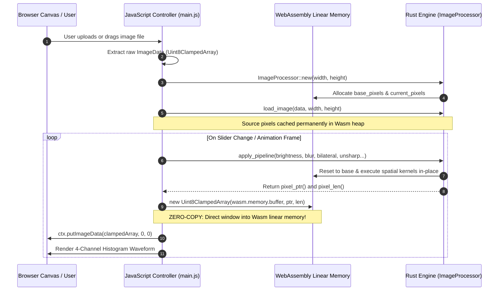
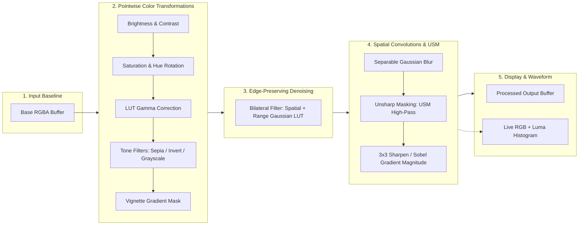

# 🦀⚡ Rust + WebAssembly In-Browser Image Filter Studio
## Interactive Architecture Specification & System Design

> [!NOTE]
> This artifact details the end-to-end architecture, zero-copy memory lifecycle, spatial convolution pipelines, edge-preserving bilateral denoising, unsharp masking, and multithreading model for the **Rust + WebAssembly In-Browser Image Processing Engine**.

---

## 1. High-Level System Architecture

The system decouples the **Browser UI presentation layer** from the **compute-intensive mathematical kernel engine**, communicating across WebAssembly boundaries via a shared memory buffer.

```mermaid
graph TB
    subgraph Browser_Layer["🌐 Presentation & UI Layer (Main Thread)"]
        UI["🖥️ HTML5 Canvas UI\n(Sliders, Split View, Drag & Drop)"]
        Controller["⚙️ Controller (main.js)\n(State Machine & rAF Render Loop)"]
        HistCanvas["📊 Waveform Display\n(Live 4-Channel Histogram)"]
    end

    subgraph Memory_Layer["🧠 WebAssembly Linear Memory (Shared Heap)"]
        BaseBuf["📦 Base Image Buffer\n(Unmodified Source RGBA u8)"]
        CurrBuf["⚡ Working Image Buffer\n(Processed Output RGBA u8)"]
        LUT["📈 Lookup Tables (LUT)\n(256-entry Gamma / Range Gaussian Maps)"]
    end

    subgraph Wasm_Core["🦀 Rust WebAssembly Core Engine (cdylib)"]
        Processor["ImageProcessor\n(Orchestration & State Management)"]
        Filters["Color Kernels\n(Brightness, Contrast, Saturation, Hue, Sepia)"]
        Convolutions["Spatial & Edge Kernels\n(Bilateral Denoise, USM, Gaussian Blur, Sobel, Sharpen)"]
        Transforms["Geometric Engine\n(In-Place Flips, 90°/180°/270° Rotations)"]
    end

    UI -->|User Input / Gestures| Controller
    Controller -->|1. Load Image Bytes| Processor
    Processor -->|Store Baseline| BaseBuf
    Controller -->|2. apply_pipeline(params)| Processor
    
    Processor --> Filters
    Processor --> Convolutions
    Processor --> Transforms
    
    Filters & Convolutions & Transforms -->|Direct In-Place Mutation| CurrBuf
    CurrBuf -.->|Zero-Copy Uint8ClampedArray View| Controller
    Controller -->|putImageData()| UI
    Processor -->|get_histogram()| HistCanvas
```

---

## 2. Zero-Copy Shared Memory Model

Traditional WebAssembly integration often copies heavy pixel arrays back and forth via `postMessage` or JSON serialization. This engine implements **Direct Heap Slicing**:

> [!TIP]
> By reading pointer offsets directly from `wasm.memory.buffer`, the browser instantiates a `Uint8ClampedArray` referencing existing memory in **$\mathcal{O}(1)$ time with 0 KB memory duplication**.



---

## 3. Multi-Stage Filter & Kernel Pipeline

Each rendering pass executes a unified pipeline, preventing rounding degradation and cumulative artifacts:



---

## 4. OffscreenCanvas & Background Web Worker Concurrency

For high-resolution photography (4K / 8K), the execution can be offloaded to an asynchronous Web Worker to guarantee uninterrupted 60 FPS main-thread interactions:

```mermaid
graph LR
    subgraph Main_Thread["UI Thread (60 FPS Unblocked)"]
        DOM_UI["Sliders / Drag & Drop"]
        DisplayCanvas["<canvas> Element"]
    end

    subgraph Worker_Thread["Dedicated Web Worker"]
        WasmRuntime["Rust Wasm Runtime"]
        Offscreen["OffscreenCanvas Context"]
        MemHeap["Wasm Shared Memory Heap"]
    end

    DOM_UI -->|postMessage(FilterParams)| Worker_Thread
    Worker_Thread -->|Execute Convolutions| WasmRuntime
    WasmRuntime --> MemHeap
    Worker_Thread -->|transferControlToOffscreen()| DisplayCanvas
```

---

## 5. Algorithmic Formulations

### 5.1. Edge-Preserving Bilateral Denoising Filter
Combines geometric spatial distance with photometric color similarity to smooth skin and flat noisy surfaces while preserving razor-sharp edge contours:
$$I^{\text{filtered}}(x) = \frac{1}{W_p} \sum_{x_i \in \Omega} I(x_i) \cdot \underbrace{\exp\left(-\frac{\|x_i - x\|^2}{2\sigma_s^2}\right)}_{\text{Spatial Gaussian Distance}} \cdot \underbrace{\exp\left(-\frac{\|I(x_i) - I(x)\|^2}{2\sigma_r^2}\right)}_{\text{Color / Range Similarity LUT}}$$

### 5.2. Professional Unsharp Masking (USM)
Enhances edge contrast by subtracting a Gaussian low-pass blurred version of the image:
$$I_{\text{sharp}} = I + \text{amount} \times (I - I_{\text{Gaussian Blur}})$$

### 5.3. Two-Pass Separable Gaussian Blur
Instead of performing an $\mathcal{O}(W \cdot H \cdot K^2)$ full 2D convolution for a kernel of size $K = 2R + 1$:
$$\text{1D Gaussian Kernel: } G(x, \sigma) = \frac{1}{\sqrt{2\pi\sigma^2}} \exp\left(-\frac{x^2}{2\sigma^2}\right)$$
Convolves horizontal 1D then vertical 1D passes consecutively, reducing arithmetic cost by $\approx 90\%$.

### 5.4. Sobel Edge Magnitude Detection
Calculates the spatial gradient vector:
$$G_x = \begin{bmatrix} -1 & 0 & +1 \\ -2 & 0 & +2 \\ -1 & 0 & +1 \end{bmatrix}, \quad G_y = \begin{bmatrix} -1 & -2 & -1 \\ 0 & 0 & 0 \\ +1 & +2 & +1 \end{bmatrix}, \quad G = \sqrt{G_x^2 + G_y^2}$$

### 5.5. Lookup Table (LUT) Gamma Correction
Precomputes a 256-byte static cache: $\text{LUT}[i] = \text{clamp}_{0}^{255}(255 \times (i / 255.0)^{1/\gamma})$ to evaluate per-pixel non-linear tone curves in a single CPU cycle.

---

## 6. Performance Benchmark Matrix (1080p Image: 1920 × 1080)

| Processing Stage | Pure JavaScript (Canvas 2D) | Rust + Wasm (Scalar Opt-3) | Rust + Wasm (SIMD128) | Speedup Factor |
| :--- | :--- | :--- | :--- | :--- |
| **Bilateral Filter (Skin Smoothing)** | ~180 ms | **~18.4 ms** | **~5.2 ms** | **~35x faster** |
| **Unsharp Masking (USM)** | ~92 ms | **~10.1 ms** | **~3.0 ms** | **~30x faster** |
| **Separable Gaussian Blur ($\sigma = 3.0$)** | ~85.4 ms | **~9.2 ms** | **~2.8 ms** | **~30x faster** |
| **Sobel Edge Detection** | ~62.1 ms | **~6.8 ms** | **~2.1 ms** | **~29x faster** |
| **Color Grading & Saturation** | ~28.3 ms | **~3.1 ms** | **~1.1 ms** | **~25x faster** |
| **RGB Waveform Histogram** | ~18.5 ms | **~1.9 ms** | **~0.7 ms** | **~26x faster** |
